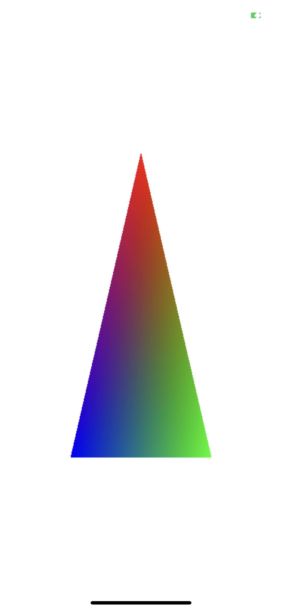

# Triangle

## 背景
-------------
    官方的默认 DEMO 是绘制一个旋转的 CUBE，对于本教程这一章来说还是太复杂了，这个 DEMO 已经包含了内置模型加载、纹理贴图、UniformBuffer、坐标变换等知识点。这里本章的 DEMO 中对原 DEMO 进一步做了减法简化，只绘制一个简单的三角形，用来分析和讲解 Metal 引擎最基本的一些知识点。

> Metal 学习，先从绘制三角形开始

## 效果
-------------



## Coding 前思考
-------------

    与 OpenGL 类似，Metal 的实现代码主要包括 3 个部分：Context、View、Render，其中 Context 类用于分配和维护 Device 及其相应的 Library 和 CommandQueue，View 类提供一个继承于 UIView 的视图，提供支持 Metal 渲染的 Layer，同时也支持触摸事件代理，方便后期图形界面交互的拓展，Render 类用来执行实际的绘制操作，所有的 Render 实例都需要一个 Context 实例进行初始化。

    此外，Context 中可以考虑加入一些图形相关的通用方法作为类方法，例如：pixelBuffer 转 texture 的方法等等。Render 是具体完成绘制操作的类，因此可以做很多的拓展，支持各种各样的绘制操作。可以考虑编写一个统一的基类 Render，而实现具体功能的Render 类都由该基类继承而来，当然我们当前的 DEMO 在那时不会考虑这种方式，目的很简单，简单的绘制一个三角形。

## 源码分析
-------------

### MetalView

> 一般很多文章和教程都是采用 MetalKit 框架中的 MTKView，它是 UIView 的子类，是 Metal 所能操作的类对象，渲染器初始化创建的时候要把 MTKView 传进去，渲染的结果最后要绘制到 MTKView 上，其实 MTKView 相当于一块画布。

```objc
+ (Class)layerClass {
    return [CAMetalLayer class];
}

- (CAMetalLayer *)metalLayer {
    return (CAMetalLayer *)self.layer;
}
```

    这里 MetalView 只做了两件事情，当然有些交互操作也可以在这里实现，暂时没有处理， metalLayer 主要是为了设置 view 的深度模板 texture 和 颜色 texture 的像素格式，颜色 texture 指的是缓存一帧渲染结果的 Framebuffer，保存的是 Color Buffer 颜色数据，而深度模板 texture 不同通道保存了 Depth Buffer 深度数据和 Stencil Buffer 模板数据。（关于 Color Buffer、Depth Buffer、Stencil Buffer的概念不了解的请自行查询和 OpenGL ES 是一样的，可以参阅我以前写的 GL 文章或者查阅 LearnOpenGLES）


### MetalContext

    MetalContext 只用于分配和维护 MTLDevice 及其相应的 MTLLibrary 和 MTLCommandQueue。

    MTLLibrary 主要用来编译和管理 Metal Shader，它应该是包含了 Metal Shading Language 的编译源码，会在程序 Build 的过程中或者运行时编译 Shader 文本。.metal 文件中的 Shader 代码实际上是 Text 文本，经过 MTLLibrary 编译后成为可执行的 MTLFunction 函数对象。此外还有 Kernel 函数，即 Computer Shader，用于 GPU 通用并行计算。

    MTLDevice 的 newDefaultLibrary 管理的是 Xcode 工程中的 .metal 文件，可识别工程目录下的 .metal 文件中的vertex 函、fragment 函数和 kernel 函数。

```objc
- (instancetype)initWithDevice:(id<MTLDevice>)device {
    if ((self = [super init])) {
        _device = device ?: MTLCreateSystemDefaultDevice();
        _library = [_device newDefaultLibrary];
        _commandQueue = [_device newCommandQueue];
    }
    return self;
}
```

### TriangleRender

    这里主要讲一下 MTLRenderPassDescriptor，它是一个很重要的 descriptor 类，它是用来设置我们当前 pass 的渲染目标（Render Target）的，这里我们使用 view 默认的配置，只有一个渲染默认的目标。在一些其他渲染技术例如延迟渲染中，需要使用这个 descriptor 配置MRT，这里不做深入介绍。

```objc
- (void)processDraw {
    id<CAMetalDrawable> drawable = [self.mtlLayer nextDrawable];
    id<MTLTexture> framebufferTexture = drawable.texture;
    if (drawable) {
        MTLRenderPassDescriptor *passDes = [MTLRenderPassDescriptor renderPassDescriptor];
        passDes.colorAttachments[0].texture = framebufferTexture;
        passDes.colorAttachments[0].clearColor = MTLClearColorMake(1.0, 1.0, 1.0, 1.0);  // 背景色;
        passDes.colorAttachments[0].storeAction = MTLStoreActionStore;
        passDes.colorAttachments[0].loadAction = MTLLoadActionClear;
        
        id<MTLCommandBuffer> cmdBuffer = [_mtlContext.commandQueue commandBuffer];
        cmdBuffer.label = @"TriangleCMD";
        
        id<MTLRenderCommandEncoder> cmdEncoder = [cmdBuffer renderCommandEncoderWithDescriptor:passDes];
        [cmdEncoder setRenderPipelineState:self.mtlRenderPipelineState];
        [cmdEncoder setVertexBuffer: _mtlVertexBuffer offset:0 atIndex:0];
        [cmdEncoder drawPrimitives: MTLPrimitiveTypeTriangle vertexStart: 0 vertexCount: 3];  // 绘制 3 个顶点;
        [cmdEncoder endEncoding];
        
        [cmdBuffer presentDrawable:drawable];
        [cmdBuffer commit];
    }
}
```