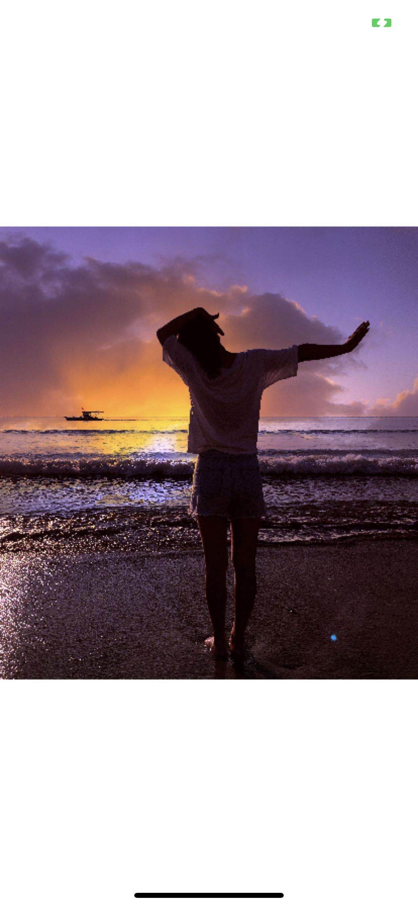
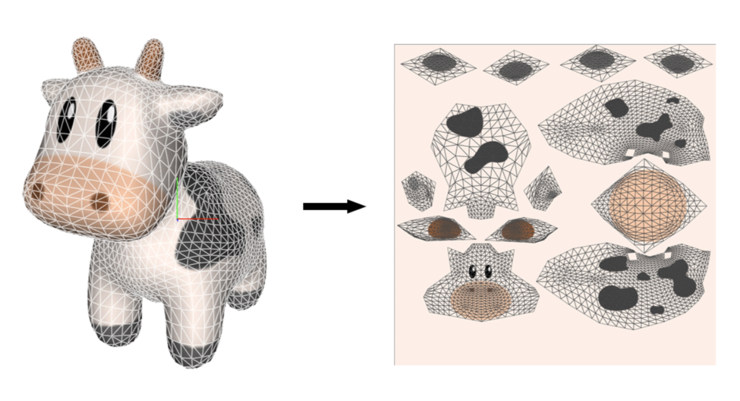
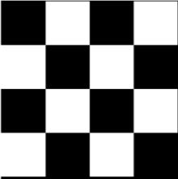
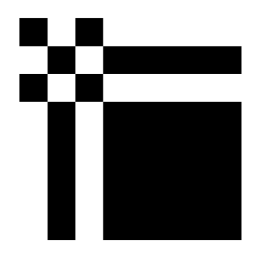
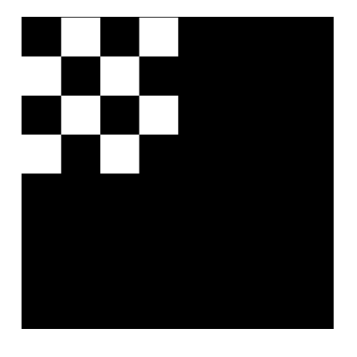
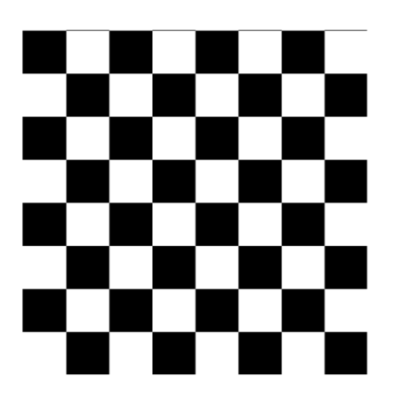
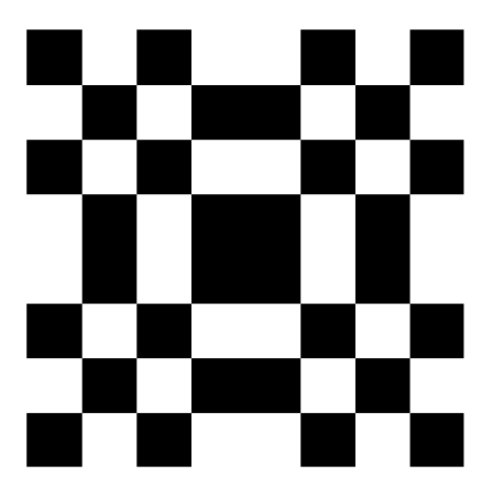

# Texture

## 背景
-------------
上一章节我们绘制了一个简单的三角形，当然理论上只要三角形绘制成功基本上后续的绘制工作就变得越来越容易理解了，那么循序渐进。

> 那么接下来，我们从简单纹理绘制继续

## 效果
-------------
<br>

<br>

## Coding 前思考
-------------

> 如果需要绘制一张纹理在手机屏幕上，我们需要加载并创建 Metal 纹理，同时准备着色器，此外在阅读源码前还是有必要了解纹理、纹理映射和纹理映射等基础概念，以便我们跟容易上手编码。

- 简介

> 如下的图是建模软件中制作输出的模型和将模型导出的时候，分离出来的纹理（俗称蒙皮），当然导出文件中还包含 OBJ 模型，纹理映射就是将网格模型中每一个顶点和纹理中一个点关联起来，通俗理解的话可以认为是一张 2D 包装纸裹到 3D 物体表面。

<br>


- 坐标系理解
    - Metal 坐标系基于左上角
    - UIKit 坐标系基于左上角
    - OpenGL 坐标系基于左下角
    - CG 坐标系基于左下角

    所以切记我们通过 CG 读取的纹理图像的时候要转换来适配 Metal 的坐标系。

- 过滤

> 纹理就是有限数量像素组成的图像，这里像素称为纹理元素（texels），然而在绘制的时候，纹理可能被绘制在高于其大小的区域或者小于其大小的区域，前者是放大，需要处理纹理元素覆盖不到的区域，如何填充颜色值？后者是缩小，需要处理很多纹理元素挤在一个区域，如何计算颜色值？

    两种方案：
    1. Nearest，选取最近的纹理元素来填充，速度快，放大时会出现块状的现象.
    2. Linear，选取最近 4 个纹理元素来计算填充值，速度足够快，效果好。


- Addressing

> 纹理映射就是将网格模型中每一个顶点和纹理中一个点结合起来，在纹理映射时，纹理坐标可能会超出 [0, 1]，超出的时候怎么处理呢，就需要 Addressing.

- 原始纹理

    

- Clamp-to-Edge Addressing(重复边界上的值)

    

- Clamp-to-Zero Addressing(全黑色或者 Clear Color，基于纹理是否有 Alpha 色值)

    

- Repeat Addressing(拿纹理来重复铺满)

    
    
- Mirrored Repeat Addressing(相邻的纹理成镜像显示而不是重复显示)
    
    

## 源码分析
-------------

### TextureLoader

> 图像加载到内存中，需要一种格式来存储，RGBA 就是一种，Metal 中支持的像素格式在 MTLPixelFormat 中描述。

- 加载图像

    ```objc
    UIImage *image = [UIImage imageNamed:name];
    ```
- 通过 CG 绘制成位图

    ```objc
    + (Byte *)loadImage:(UIImage *)image {
        // 1.获取图片的CGImageRef;
        CGImageRef spriteImage = image.CGImage;

        // 2.读取图片的大小;
        size_t width = CGImageGetWidth(spriteImage);
        size_t height = CGImageGetHeight(spriteImage);

        Byte * spriteData = (Byte *) calloc(width * height * 4, sizeof(Byte)); // rgba 共 4 个 byte;
        CGContextRef spriteContext = CGBitmapContextCreate(spriteData, 
                                                        width, 
                                                        height, 
                                                        8, 
                                                        width * 4,
                                                        CGImageGetColorSpace(spriteImage), 
                                                        kCGImageAlphaPremultipliedLast);

        // 3.在CGContextRef上绘图;
        CGContextDrawImage(spriteContext, CGRectMake(0, 0, width, height), spriteImage);
        CGContextRelease(spriteContext);

        return spriteData;
    }
    ```

- 创建纹理 & 把位图数据放到 Texture 中

    ```objc
    + (id<MTLTexture>)loadTexture:(id<MTLDevice>)device imageNamed:(NSString *)name {
        id<MTLTexture> mtlTexture;
        UIImage *image = [UIImage imageNamed:name];
        MTLTextureDescriptor *textureDesc = [[MTLTextureDescriptor alloc] init];
        textureDesc.pixelFormat = MTLPixelFormatRGBA8Unorm_sRGB;
        textureDesc.width = image.size.width;
        textureDesc.height = image.size.height;
        mtlTexture = [device newTextureWithDescriptor:textureDesc];

        // 纹理上传的范围;
        MTLRegion region = {{ 0, 0, 0 }, {image.size.width, image.size.height, 1}};

        // UIImage 的数据需要转成二进制才能上传，且不用jpg、png 的 NSData;
        Byte *imageBytes = [self loadImage:image];
        if (imageBytes) {
            [mtlTexture replaceRegion:region mipmapLevel:0 withBytes:imageBytes bytesPerRow:4 * image.size.width];
            free(imageBytes); // 需要释放资源;
            imageBytes = NULL;
        }
        
        textureDesc.usage = MTLTextureUsageShaderRead | MTLTextureUsageShaderWrite;

        return mtlTexture;
    }
    ```
- 当然也可以采用如下便捷的方式，可自行了解

    ```objc
    + (id<MTLTexture>)loadTexture:(id<MTLDevice>)device assertName:(NSString *)name {
        id<MTLTexture> retTexture;
        NSError *error;
        MTKTextureLoader* textureLoader = [[MTKTextureLoader alloc] initWithDevice:device];
        NSDictionary *textureLoaderOptions =
        @{
        MTKTextureLoaderOptionTextureUsage       : @(MTLTextureUsageShaderRead), // 表示我们这张贴图是只读的，不可写入;
        MTKTextureLoaderOptionTextureStorageMode : @(MTLStorageModePrivate) // 表示我们张贴图只有 GPU 可以访问，CPU 不可访问，这种模式下 Metal 可以进一步做一些优化，提高性能;
        };
        retTexture = [textureLoader newTextureWithName:name
                                        scaleFactor:1.0
                                            bundle:nil
                                            options:textureLoaderOptions
                                                error:&error];
        retTexture.label = @"retTexture";
        if(!retTexture || error) {
            NSLog(@"Error creating texture %@", error.localizedDescription);
        }
        return retTexture;
    }
    ```

### TextureRender

> 准备渲染环境和渲染数据，提供渲染接口；

- 绘制数据准备

    ```objc
    /*由于图片是正方形的，所以顶点坐标 Y 选取 0.5*/
    static const Vertex textureVertices[] = { 
        { .position = {  1.0, -0.5, 0.0, 1.0 }, .textureCoordinate = { 1.0, 1.0 } },
        { .position = { -1.0, -0.5, 0.0, 1.0 }, .textureCoordinate = { 0.0, 1.0 } },
        { .position = { -1.0,  0.5, 0.0, 1.0 }, .textureCoordinate = { 0.0, 0.0 } },
        
        { .position = {  1.0, -0.5, 0.0, 1.0 }, .textureCoordinate = { 1.0, 1.0 } },
        { .position = { -1.0,  0.5, 0.0, 1.0 }, .textureCoordinate = { 0.0, 0.0 } },
        { .position = {  1.0,  0.5, 0.0, 1.0 }, .textureCoordinate = { 1.0, 0.0 } },
    };
    ```

- 渲染

    ```objc
    - (void)processDraw:(id<MTLTexture>) inTexture {
        id<CAMetalDrawable> drawable = [self.mtlLayer nextDrawable];
        id<MTLTexture> framebufferTexture = drawable.texture;
        if (drawable) {
            id<MTLCommandBuffer> cmdBuffer = [_mtlContext.commandQueue commandBuffer];
            cmdBuffer.label = @"TextureCMD";
            
            MTLRenderPassDescriptor *passDesc = [MTLRenderPassDescriptor renderPassDescriptor];
            passDesc.colorAttachments[0].texture = framebufferTexture;
            passDesc.colorAttachments[0].clearColor = MTLClearColorMake(1.0, 1.0, 1.0, 1.0); // 背景色;
            passDesc.colorAttachments[0].storeAction = MTLStoreActionStore;
            passDesc.colorAttachments[0].loadAction = MTLLoadActionClear;
            
            id<MTLRenderCommandEncoder> cmdEncoder = [cmdBuffer renderCommandEncoderWithDescriptor:passDesc];
            [cmdEncoder setRenderPipelineState:self.mtlRenderPipelineState]; // 设置渲染管道，以保证顶点和片元两个 Shader 会被调用;
            [cmdEncoder setVertexBuffer:self.mtlVertexBuffer offset:0 atIndex:0]; // 设置顶点缓存;
            [cmdEncoder setFragmentTexture:inTexture atIndex:0]; // 设置纹理;
            [cmdEncoder setFragmentSamplerState:self.mtlSamplerState atIndex:0]; // 设置采样状态;
            [cmdEncoder drawPrimitives:MTLPrimitiveTypeTriangle vertexStart:0 vertexCount:self.vCnt]; // 绘制;
            [cmdEncoder endEncoding];
            
            [cmdBuffer presentDrawable:drawable]; // 显示;
            [cmdBuffer commit];
        }
    }
    ```