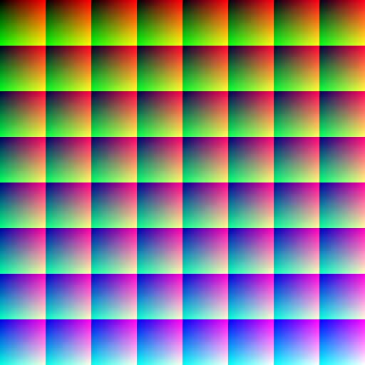

# LUT

## 背景
-------------

>  

## 效果
-------------


## Coding 前思考
-------------

- LUT 是什么 ？

    首先我们先来理解一下概念，LUT 是 Look Up Table，查找表的缩写，所有的颜色都可以在一张表(实际上一张图片)上找到。我们知道 R、G、B 三种颜色分别有 256 种取值，所有的颜色组合就有 256 * 256 * 256 种组合，大约占 48MB 空间，占用很大的内存，但是有了 LUT 映射表后，我们就可以对任意一张图片进行相同的滤镜变换。我们遍历图片的像素点，对于每一个像素点，获得其 RGB 组合，在 LUT 表格中查找此 RGB 组合及其对应的 RGB 映射值，然后用 RGB 映射值替换原图的像素点，就可以完成滤镜变换了。

- 如何在一张图片中存储三种颜色值的组合呢 ？

    
    
    上图就是一张标准的颜色查找表（原色的颜色查表）。它在横竖方向上分成了 8 * 8 一共 64 个小方格(当让 4 * 4 或者 16 * 16 也可以)，每一个小方格内的 B 分量为一个定值，总共就表示了 B 分量的 64 种可能值。同时对于每一个小方格，横竖方向又各自分为 64 个小格，横向小格的 R 分量依次增加，纵向小格的 G 分量依次增加。即：

    - 整体对每个小方块而言，从左上往右下 B 从 0 到 1 ，是 z 字型的顺序
    - 单独对每个小方块而言，从左到右 R 从 0 到 1，代表 x
    - 单独对每个小方块而言，从上到下 G 从 0 到 1，代表 y

    所以得到 RGB(0, 0, 1（注意：1 代表 255）) 的纯蓝色对应的位置应该是 (7, 7)，右下角的那个方块。
    
- 那么如何根据颜色查找表得到转换后的颜色呢 ？

    - 用蓝色值 B 计算正方形的位置，假如一个像素点原来 RGB 是 (0.1, 0.2, 0.4)，那么 B = 0.4，则 (0.4 * 63 = 25.2) / 8 = 3（蓝色部分[0, 63] 共64种），（25（源于上一步计算的25.2） - 3 * 8）= 1，即第 3 行第 1 列的那个大正方形，quad1.y = 3，quad1.x = 1。

    - 根据红色值和绿色值计算对应位置在整个纹理的坐标
    
        texPos1.x = (quad1.x * 64 + rgb.r * 63 + 0.5) / 512.0

        texPos1.y = (quad1.y * 64 + rgb.g * 63 + 0.5) / 512.0

        注：quad1.x * 64 意思是：quad1.x 和 quad1.y 是大正方形的坐标，每个大正方形是 64 格，所以乘以 64，rgb.r * 63 意思是：每个大正方形是 64 格，即(0, 63)，加上 0.5 表示每个最小的小正方形的中心点，最后除以 512.0 是因为整个 LUT 图片是 512 * 512 的，被放大了 512 倍，最后得到的是每个小正方格中心在整个 LUT 大图中的坐标。

    - 根据 texPos1 和 texPos2 读取映射结果，再用蓝色值的小数部分进行 MIX 操作

## Lut Metal Shader
-------------

    ```c++
    fragment float4 lut_texture_fragment(RasterizerData input [[stage_in]],
                                        constant float &intensity [[buffer(2)]],
                                        constant LutInfo &lutInfo [[buffer(3)]],
                                        texture2d<float> normalTexture [[ texture(FTINormal) ]],
                                        texture2d<float> lutTexture [[ texture(FTILut) ]]) {
        constexpr sampler textureSampler (mag_filter::linear, min_filter::linear); // sampler 是采样器;
        float4 textureColor = normalTexture.sample(textureSampler, input.textureCoordinate); // 正常的纹理颜色;
        
        float blueColor = textureColor.b * 63.0; // 蓝色部分 [0, 63] 共 64 种;
        
        float2 quad1; // 第一个正方形的位置, 假如 blueColor = 22.5，则 y = 22 / 8 = 2，x = 22 - 8 * 2 = 6，即是第 2 行，第 6 个正方形；（因为 y 是纵坐标）;
        quad1.y = floor(floor(blueColor) * 0.125);
        quad1.x = floor(blueColor) - (quad1.y * 8.0);
        
        float2 quad2; // 第二个正方形的位置，同上。注意 x、y 坐标的计算，还有这里用 int 值也可以，但是为了效率使用 float;
        quad2.y = floor(ceil(blueColor) * 0.125);
        quad2.x = ceil(blueColor) - (quad2.y * 8.0);
        
        float2 texPos1; // 计算颜色 (r, b, g) 在第一个正方形中对应位置;
        texPos1.x = ((quad1.x * 64) +  textureColor.r * 63 + 0.5) / 512.0;
        texPos1.y = ((quad1.y * 64) +  textureColor.g * 63 + 0.5) / 512.0;
        
        float2 texPos2; // 同上;
        texPos2.x = ((quad2.x * 64) +  textureColor.r * 63 + 0.5) / 512.0;
        texPos2.y = ((quad2.y * 64) +  textureColor.g * 63 + 0.5) / 512.0;
        
        float4 newColor1 = lutTexture.sample(textureSampler, texPos1); // 正方形 1 的颜色值;
        float4 newColor2 = lutTexture.sample(textureSampler, texPos2); // 正方形 2 的颜色值;
        
        float4 newColor = mix(newColor1, newColor2, fract(blueColor)); // 根据小数点的部分进行 mix;
        
        return float4(newColor.rgb, textureColor.w); // 不修改alpha值;
    }
    ```